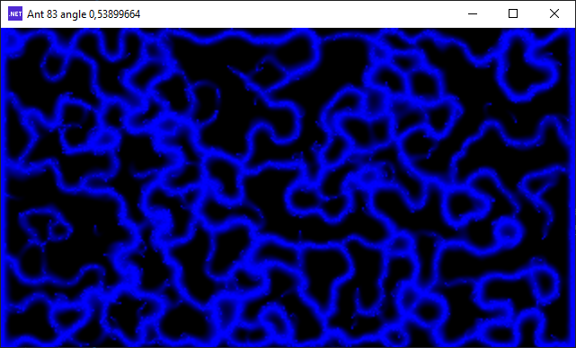

# BlodSimu

## Introduction

Blob Simulation est une simulation de vie.
Ici sont présents 3 versions : 
- une application Qt fonctionnant avec opengl
- une application DotNet fonctionnant avec DirectX
- une application Web fonctionnant avec WebGl

Toutes ces versions cherchent à paralléliser les calcules afin d'avoir un affichage temps réel 

